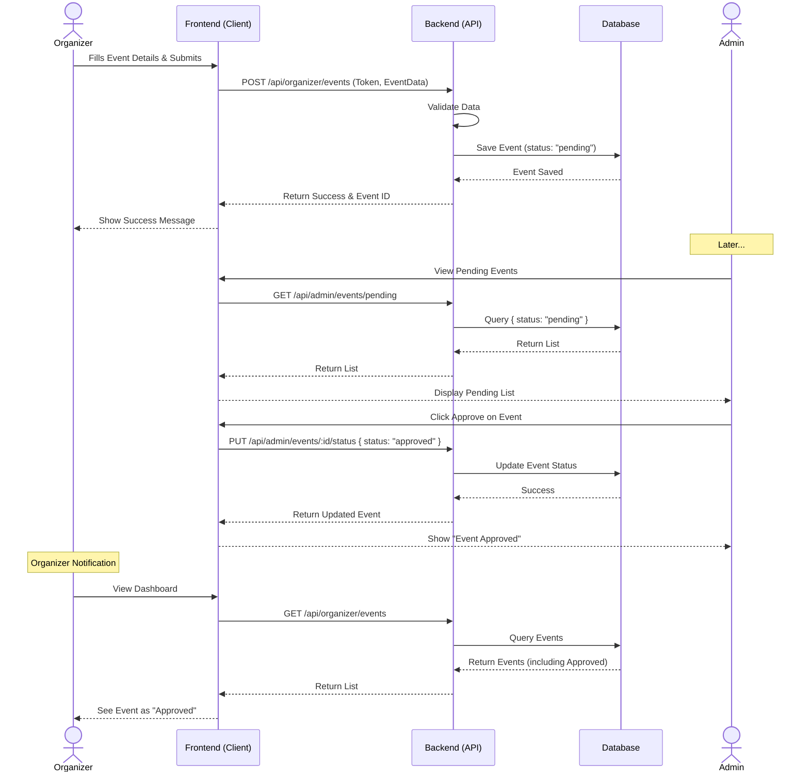
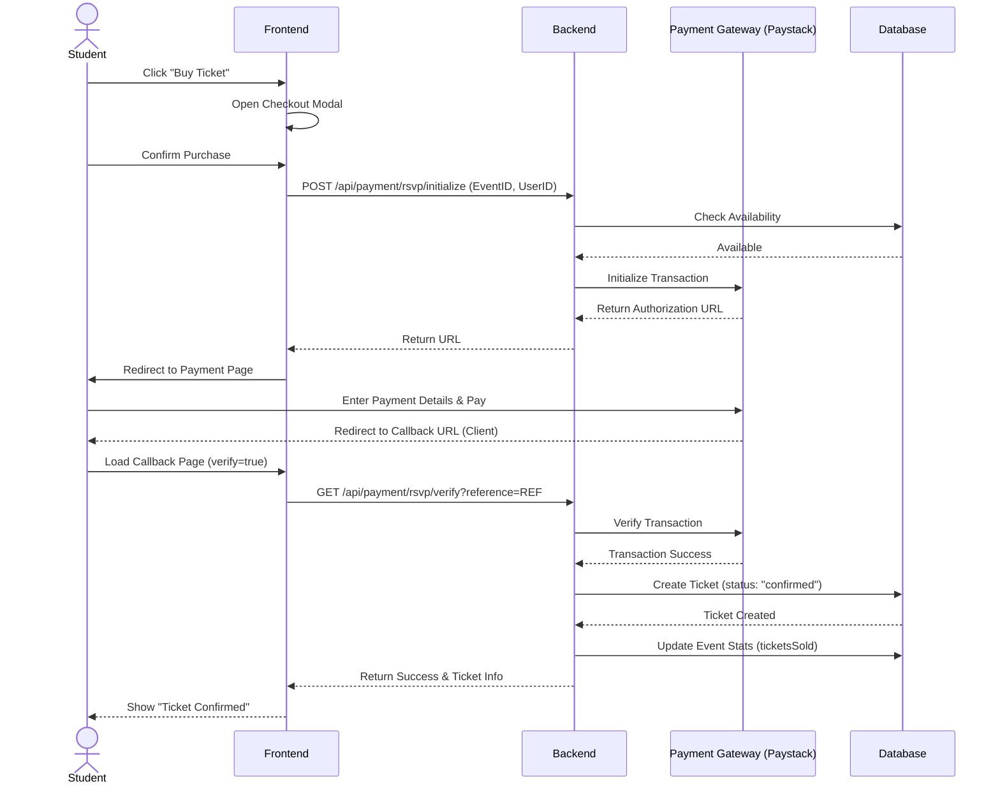

# Behavioral Diagrams

## Event Creation and Approval Sequence

This sequence diagram illustrates the process of an Organizer creating an event and an Admin approving it.

## Ticket Purchase Sequence

This diagram shows the flow for a student purchasing a ticket for a paid event.

