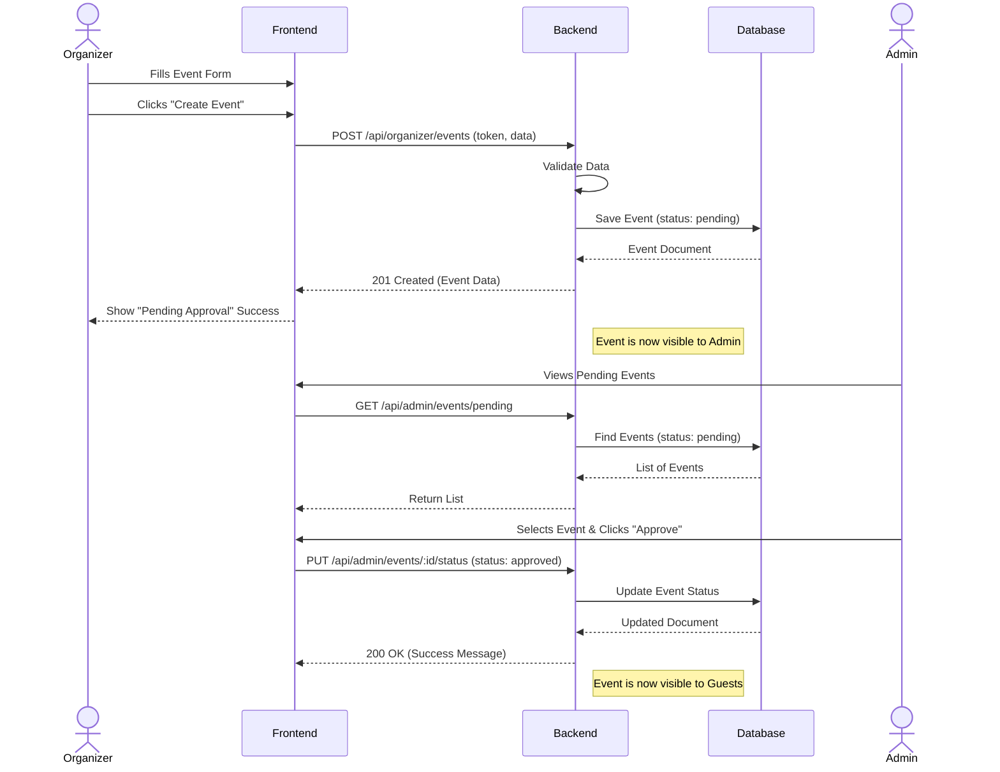
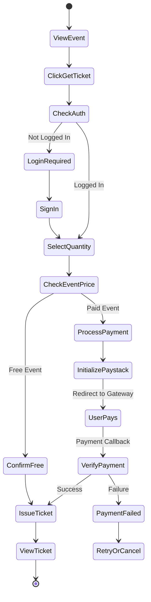

# Behavioral Diagrams

## Event Creation and Approval Flow (Sequence Diagram)

```mermaid
sequenceDiagram
    actor Organizer
    participant Frontend
    participant Backend
    participant Database
    actor Admin

    Organizer->>Frontend: Fills Event Form
    Organizer->>Frontend: Clicks "Create Event"
    Frontend->>Backend: POST /api/organizer/events (token, data)
    Backend->>Backend: Validate Data
    Backend->>Database: Save Event (status: pending)
    Database-->>Backend: Event Document
    Backend-->>Frontend: 201 Created (Event Data)
    Frontend-->>Organizer: Show "Pending Approval" Success

    Note right of Backend: Event is now visible to Admin

    Admin->>Frontend: Views Pending Events
    Frontend->>Backend: GET /api/admin/events/pending
    Backend->>Database: Find Events (status: pending)
    Database-->>Backend: List of Events
    Backend-->>Frontend: Return List

    Admin->>Frontend: Selects Event & Clicks "Approve"
    Frontend->>Backend: PUT /api/admin/events/:id/status (status: approved)
    Backend->>Database: Update Event Status
    Database-->>Backend: Updated Document
    Backend-->>Frontend: 200 OK (Success Message)

    Note right of Backend: Event is now visible to Guests
```

## Ticket Purchase Flow (Activity Diagram)

```mermaid
stateDiagram-v2
    [*] --> ViewEvent
    ViewEvent --> ClickGetTicket
    ClickGetTicket --> CheckAuth

    state CheckAuth <<choice>>
    CheckAuth --> LoginRequired: Not Logged In
    CheckAuth --> SelectQuantity: Logged In

    LoginRequired --> SignIn
    SignIn --> SelectQuantity

    SelectQuantity --> CheckEventPrice

    state CheckEventPrice <<choice>>
    CheckEventPrice --> ProcessPayment: Paid Event
    CheckEventPrice --> ConfirmFree: Free Event

    ProcessPayment --> InitializePaystack
    InitializePaystack --> UserPays: Redirect to Gateway
    UserPays --> VerifyPayment: Payment Callback

    state VerifyPayment <<choice>>
    VerifyPayment --> IssueTicket: Success
    VerifyPayment --> PaymentFailed: Failure

    ConfirmFree --> IssueTicket

    IssueTicket --> ViewTicket
    PaymentFailed --> RetryOrCancel

    ViewTicket --> [*]
```
