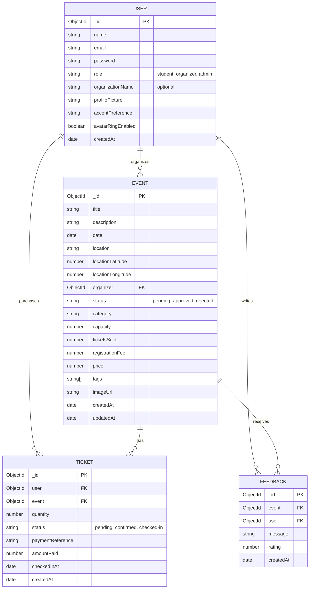

# Database Design

## Entity Relationship Diagram (ERD)

This diagram represents the MongoDB schema design using Mongoose models.

```mermaid
erDiagram
    USER ||--o{ EVENT : "organizes"
    USER ||--o{ TICKET : "purchases"
    USER ||--o{ FEEDBACK : "writes"
    EVENT ||--o{ TICKET : "has"
    EVENT ||--o{ FEEDBACK : "receives"

    USER {
        ObjectId _id PK
        string name
        string email
        string password
        string role "student, organizer, admin"
        string organizationName "optional"
        string profilePicture
        string accentPreference
        boolean avatarRingEnabled
        date createdAt
    }

    EVENT {
        ObjectId _id PK
        string title
        string description
        date date
        string location
        number locationLatitude
        number locationLongitude
        ObjectId organizer FK
        string status "pending, approved, rejected"
        string category
        number capacity
        number ticketsSold
        number registrationFee
        number price
        string[] tags
        string imageUrl
        date createdAt
        date updatedAt
    }

    TICKET {
        ObjectId _id PK
        ObjectId user FK
        ObjectId event FK
        number quantity
        string status "pending, confirmed, checked-in"
        string paymentReference
        number amountPaid
        date checkedInAt
        date createdAt
    }

    FEEDBACK {
        ObjectId _id PK
        ObjectId event FK
        ObjectId user FK
        string message
        number rating
        date createdAt
    }
```
