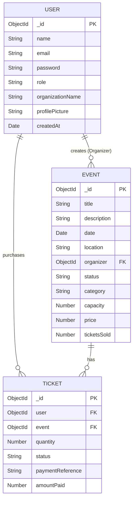

# Database Design

## Entity Relationship Diagram

```mermaid
erDiagram
    USER ||--o{ EVENT : "creates (Organizer)"
    USER ||--o{ TICKET : "purchases"
    EVENT ||--o{ TICKET : "has"

    USER {
        ObjectId _id PK
        String name
        String email
        String password
        String role
        String organizationName
        String profilePicture
        Date createdAt
    }

    EVENT {
        ObjectId _id PK
        String title
        String description
        Date date
        String location
        ObjectId organizer FK
        String status
        String category
        Number capacity
        Number price
        Number ticketsSold
    }

    TICKET {
        ObjectId _id PK
        ObjectId user FK
        ObjectId event FK
        Number quantity
        String status
        String paymentReference
        Number amountPaid
    }
```
