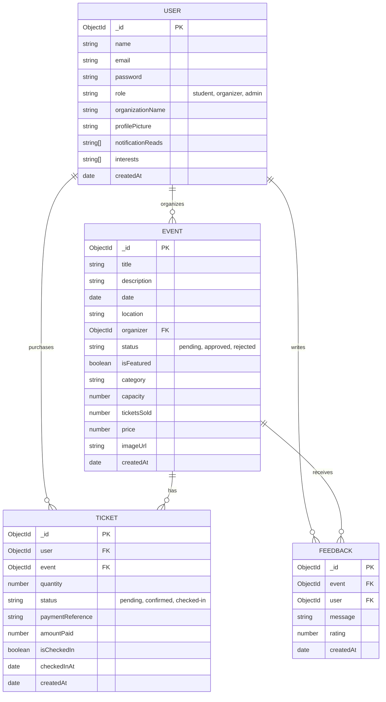

# Database Design

## Entity Relationship Diagram (ERD)

This diagram represents the database schema and relationships based on the Mongoose models.

```mermaid
erDiagram
    USER ||--o{ EVENT : "organizes"
    USER ||--o{ TICKET : "purchases"
    USER ||--o{ FEEDBACK : "writes"
    EVENT ||--o{ TICKET : "has"
    EVENT ||--o{ FEEDBACK : "receives"

    USER {
        ObjectId _id PK
        string name
        string email
        string password
        string role "student, organizer, admin"
        string organizationName
        string profilePicture
        string[] notificationReads
        string[] interests
        date createdAt
    }

    EVENT {
        ObjectId _id PK
        string title
        string description
        date date
        string location
        ObjectId organizer FK
        string status "pending, approved, rejected"
        boolean isFeatured
        string category
        number capacity
        number ticketsSold
        number price
        string imageUrl
        date createdAt
    }

    TICKET {
        ObjectId _id PK
        ObjectId user FK
        ObjectId event FK
        number quantity
        string status "pending, confirmed, checked-in"
        string paymentReference
        number amountPaid
        boolean isCheckedIn
        date checkedInAt
        date createdAt
    }

    FEEDBACK {
        ObjectId _id PK
        ObjectId event FK
        ObjectId user FK
        string message
        number rating
        date createdAt
    }
```
