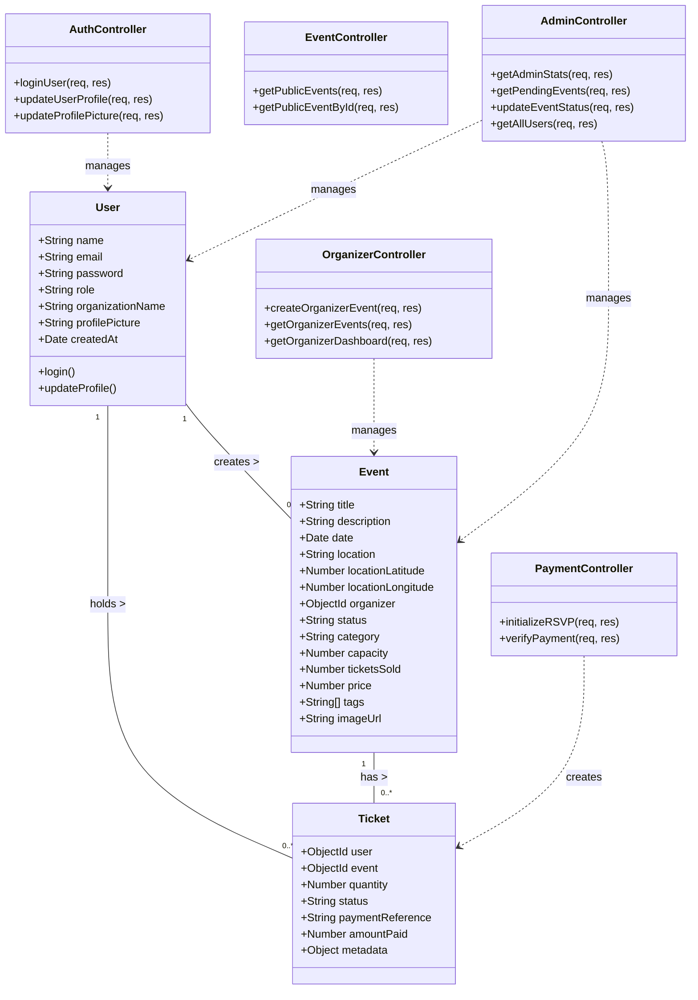

# Structural Diagrams

## Class Diagram

```mermaid
classDiagram
    class User {
        +String name
        +String email
        +String password
        +String role
        +String organizationName
        +String profilePicture
        +Date createdAt
        +login()
        +updateProfile()
    }

    class Event {
        +String title
        +String description
        +Date date
        +String location
        +Number locationLatitude
        +Number locationLongitude
        +ObjectId organizer
        +String status
        +String category
        +Number capacity
        +Number ticketsSold
        +Number price
        +String[] tags
        +String imageUrl
    }

    class Ticket {
        +ObjectId user
        +ObjectId event
        +Number quantity
        +String status
        +String paymentReference
        +Number amountPaid
        +Object metadata
    }

    class AuthController {
        +loginUser(req, res)
        +updateUserProfile(req, res)
        +updateProfilePicture(req, res)
    }

    class EventController {
        +getPublicEvents(req, res)
        +getPublicEventById(req, res)
    }

    class OrganizerController {
        +createOrganizerEvent(req, res)
        +getOrganizerEvents(req, res)
        +getOrganizerDashboard(req, res)
    }

    class AdminController {
        +getAdminStats(req, res)
        +getPendingEvents(req, res)
        +updateEventStatus(req, res)
        +getAllUsers(req, res)
    }

    class PaymentController {
        +initializeRSVP(req, res)
        +verifyPayment(req, res)
    }

    User "1" -- "0..*" Event : creates >
    User "1" -- "0..*" Ticket : holds >
    Event "1" -- "0..*" Ticket : has >

    AuthController ..> User : manages
    OrganizerController ..> Event : manages
    AdminController ..> User : manages
    AdminController ..> Event : manages
    PaymentController ..> Ticket : creates
```
