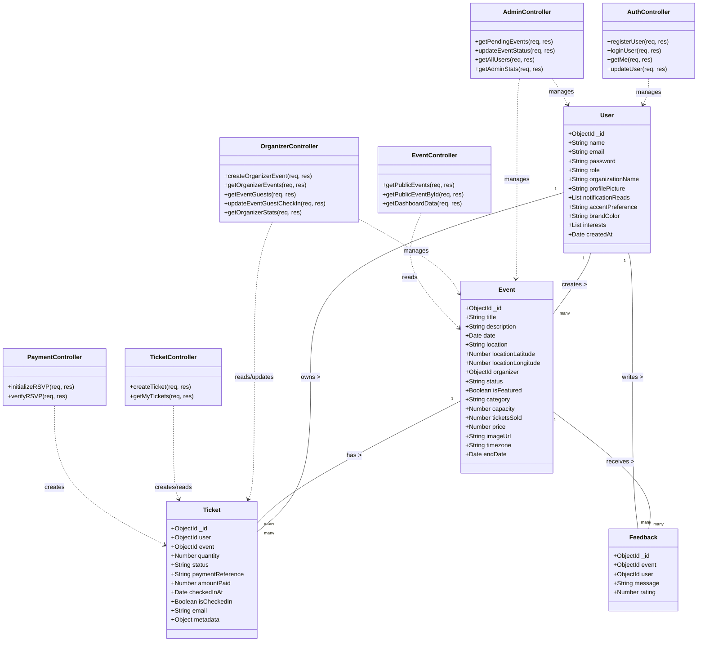

# Structural Diagrams

## Class Diagram

This diagram represents the main backend classes (Controllers) and Data Models, showing their relationships and key methods/attributes based on the current codebase.

