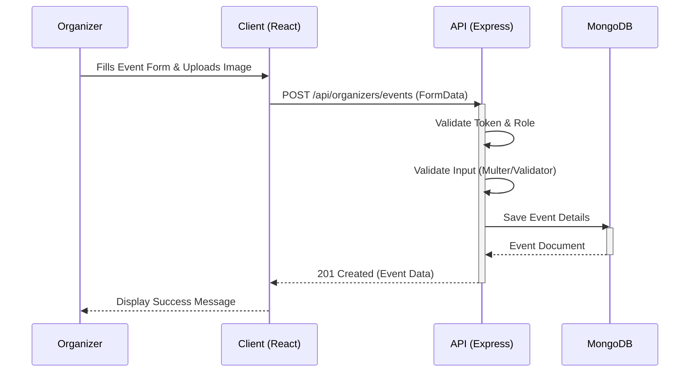
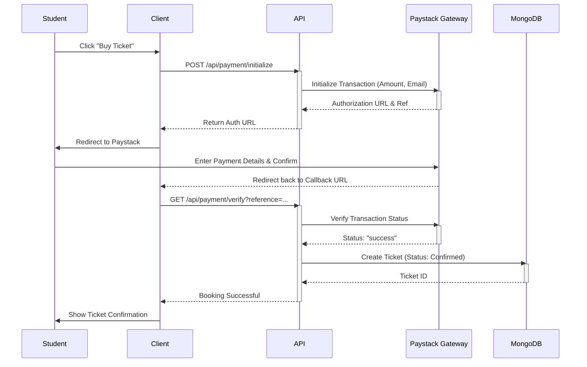
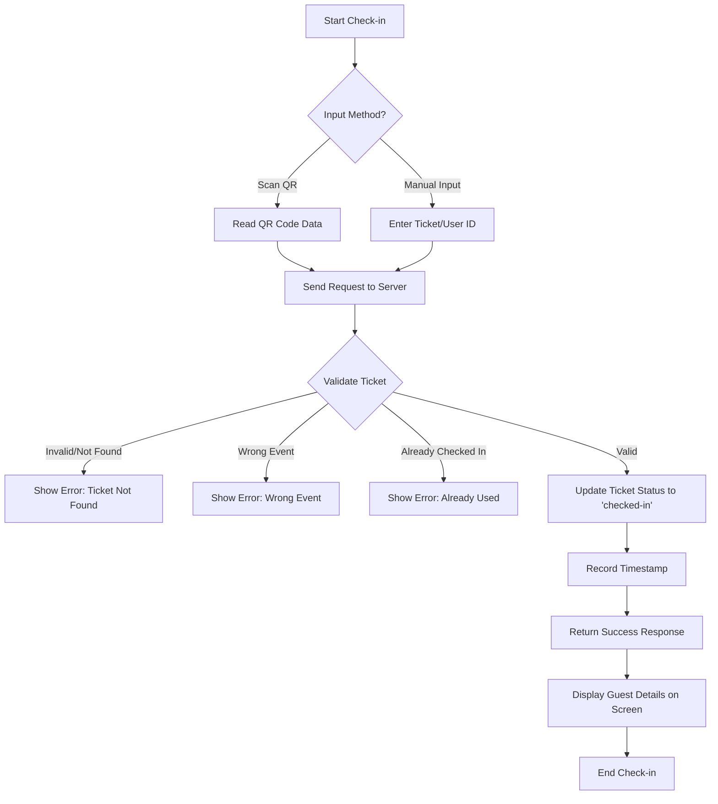

# Behavioral Diagrams

## 1. Event Creation Flow (Sequence Diagram)

## 2. Guest Ticket Booking Flow (Sequence Diagram)

This diagram illustrates the flow for a **Paid** event booking.

## 3. Check-in Flow (Activity Diagram)

