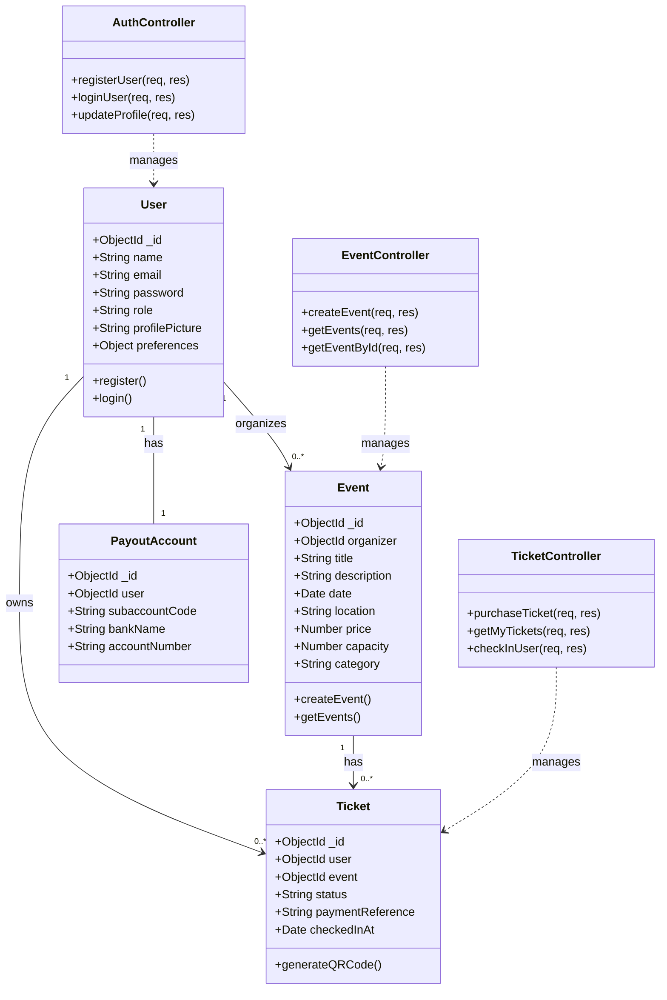

# Structural Diagrams

## Class Diagram

This diagram represents the core backend modules (Models and Controllers) and their relationships.

```mermaid
classDiagram
    class User {
        +ObjectId _id
        +String name
        +String email
        +String password
        +String role
        +String profilePicture
        +Object preferences
        +register()
        +login()
    }

    class Event {
        +ObjectId _id
        +ObjectId organizer
        +String title
        +String description
        +Date date
        +String location
        +Number price
        +Number capacity
        +String category
        +createEvent()
        +getEvents()
    }

    class Ticket {
        +ObjectId _id
        +ObjectId user
        +ObjectId event
        +String status
        +String paymentReference
        +Date checkedInAt
        +generateQRCode()
    }

    class PayoutAccount {
        +ObjectId _id
        +ObjectId user
        +String subaccountCode
        +String bankName
        +String accountNumber
    }

    class AuthController {
        +registerUser(req, res)
        +loginUser(req, res)
        +updateProfile(req, res)
    }

    class EventController {
        +createEvent(req, res)
        +getEvents(req, res)
        +getEventById(req, res)
    }

    class TicketController {
        +purchaseTicket(req, res)
        +getMyTickets(req, res)
        +checkInUser(req, res)
    }

    %% Relationships
    User "1" --> "0..*" Event : organizes
    User "1" --> "0..*" Ticket : owns
    Event "1" --> "0..*" Ticket : has
    User "1" -- "1" PayoutAccount : has

    AuthController ..> User : manages
    EventController ..> Event : manages
    TicketController ..> Ticket : manages
```
