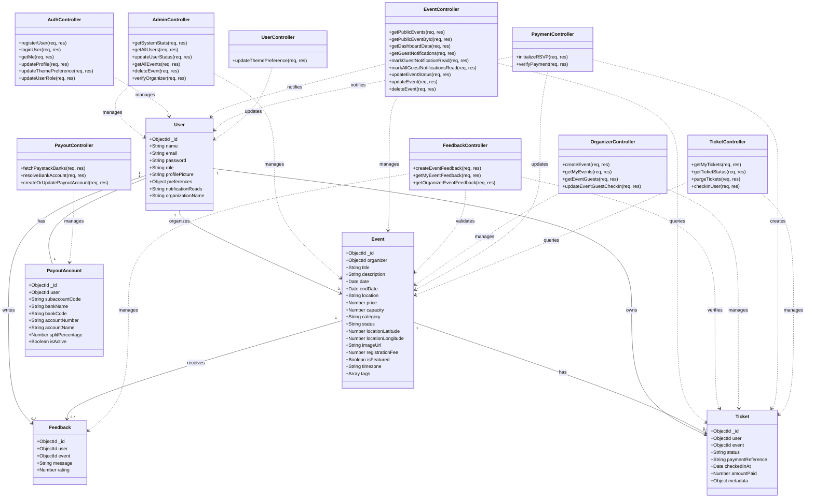

# Structural Diagrams

## Class Diagram

This diagram represents the core backend modules (Models and Controllers) and their relationships. It exhaustively covers all controllers and models found in the codebase.

